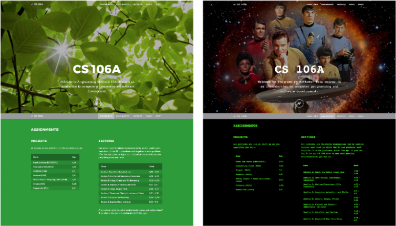

## I'm on the academic job market this year!

I'm a sixth year Ph.D. candidate in [Computer Science][cs] at [Stanford University][stanford] in the [Human-Computer Interaction Group][hci], co-advised by [James Landay][landay] (Computer Science) and [Jeff Hancock][hancock] (Communication). In my research, I develop and deploy methods for studying **bias and representation in algorithms and algorithmic content**, focusing on high-stakes social settings like politics and employment, and on the experiences of maginalized people. 

[cs]: http://www-cs.stanford.edu/
[stanford]: https://www.stanford.edu/
[hci]:http://hci.stanford.edu/
[hancock]: http://jeff-hancock.com
[landay]: https://profiles.stanford.edu/james-landay

Projects I've worked on include gender and race representation in search algorithms (_in submission_), [stereotypes and inclusivity in web interfaces][gender-inclusive], [the role of search media in elections][search media], and [social capital during disaster events][disasters].

[search media]: https://dl.acm.org/doi/abs/10.1145/3359231
[disasters]: https://dl.acm.org/citation.cfm?id=3274391
[gender-inclusive]: https://dl.acm.org/citation.cfm?id=3173574.3174188

In addition to academic publications, I've written for a general audience on topics like [political bias in search results in _The Guardian_][guardian], and [social media sites and democracy in _Wired_][wired]. 

[wired]: https://www.wired.co.uk/article/how-to-fix-facebook
[guardian]:https://www.theguardian.com/commentisfree/2018/sep/06/google-search-results-rigged-news-donald-trump

Before my PhD, I graduated with dual degrees in Computer Science alongside Science, Technology, and Society at Brown University in 2015. 

P.S. My first name is pronounced like the verb "deny". 

---

## Research Highlights 

I have several ongoing threads of research, mainly focusing on bias and representation in algorithmic content, using a combination of computational and behavioral social science methods. 

### Gender and Race Representation in Image Search Results

**[An Image of Society: Gender and Racial Representation and Impact in Image Search Results for Occupations][image society]**\
**Danaë Metaxa**, Michelle Gan, Su Goh, James Landay, and Jeff Hancock. _In submission (R&R) to CSCW21_

Visual diversity has been the subject of studies in domains like psychology and advertising. But unlike the purposeful persuasive intent behind advertising, algorithmic content like search engine results are compiled automatically and spontaneously in response to user queries. Regardless of intent, the impact on users—say, a young person of color looking for information about their desired career and finding a sea of white faces—may still be substantial. **Do image search results accurately reflect real-world gender and racial diversity? How does visual diversity influence users?**

In this project, currently in submission, we conducted an audit examining the results of Google Image queries for fifty common occupations, found that women and people of color were underrepresented relative to men and whites, and that the degree of this underrepresentation was not reflective of workforce participation. We then conducted a randomized controlled study exposing participants to a search results varying degrees of gender and racial diversity, finding that participants perceived occupations to be more inclusive when search results showed more women or people of color, and that participants’ interest in joining an occupation was greater when more people of color were represented. However, increasing the proportion of women actually decreased participant interest in some cases (perhaps an effect of perceived occupational feminization). We also examined the influence of participants’ own identities on their experience of image search results, finding that marginalized identity mediated participants’ expectation of being valued (e.g., greater representation of women was received positively by women participants but in some cases had a negative impact on men). Designing technology for inclusivity and belonging requires satisfying a complex and sometimes contradictory set of constraints; there is no silver bullet solution to make algorithms “fair” for all.

[image society]: http://metaxa.net/content/papers/ImageSociety_2020.pdf

### Inclusive Web Design

**[Gender-Inclusive Design: Belonging and Bias in Web Interfaces][ambient belonging]**\
**Danaë Metaxa**, Kelly Wang, James Landay, and Jeff Hancock. (ACM CHI 2018)

Psychology theory suggests that people's ambient environments can cue stereotypes and influence their sense of belonging. Do digital spaces also impact self perception and choices? To answer this question, we ran a randomized controlled experiment to investigate, designing two different versions of a computer science course webpage altering only the aesthetics of the page but not its content. College-aged participants were either exposed to a course page with a neutral theme (i.e., images of trees, standard sans serif fonts) or one designed to evoke stereotypical ideas of computer science (i.e., star trek imagery, green text on a black background resembling a computer console). We found that, while men showed little preference for either website, women were negatively impacted by the stereotypical interface—they were less likely to feel they belonged in the course, less optimistic about their future performance, less interested in taking the course, and less interested in studying computer science at all. On the whole, women were 20% less likely to want to enroll in the course, a deterring effect of about twice that on men. This work uses gender bias as a case study supporting literature from psychology and translating it to a digital context; biases in online content can significantly impact users’ psychological sense of belonging, beliefs about themselves, and expected future behaviors. 

[ambient belonging]: http://metaxa.net/content/papers/InclusiveDesign_CHI18.pdf

### Algorithm Audits: Past, Present, and Best Practices

_Manuscript in preparation in collaboration with Joon Sung Park, Ronald E. Robertson, Karrie Karahalios, Christo Wilson, and Christian Sandvig._

Conducting a rigorous and effective algorithm audit like those I often deploy in my work entails legal and ethical challenges, as well as technical ones. I am currently leading a collaboration between leading algorithm audit researchers at Stanford, the University of Illinois at Urbana-Champaign, Northeastern University, and the University of Michigan to produce a journal article explaining the intellectual and scientific contributions of this important and versatile method, along with guidelines and best practices—technical, legal, and ethical—for conducting successful audit studies.

---

## Other Recent Publications
For a complete list of my academic publications, see my [Google Scholar page][scholar].

[scholar]: https://scholar.google.com/citations?user=6pA2wn4AAAAJ

[Random, Messy, Funny, Raw: Finstas as Intimate Reconfigurations of Social Media][finsta]\
_Best Paper Honorable Mention_\
Sijia Xiao, **Danaë Metaxa**, Joon Sung Park, Karrie Karahalios, and Niloufar Salehi (ACM CHI 2020)

[Search Media and Elections: A Longitudinal Investigation of Political Search Results in the 2018 U.S. Elections][search media]\
**Danaë Metaxa**, Joon Sung Park, James Landay, and Jeff Hancock (ACM CSCW 2019)

[Glasnost! Nine ways Facebook can make itself a better forum for free speech and democracy][glasnost]\
Timothy Garton Ash, Robert Gorwa, and **Danaë Metaxa** (Reuters Institute for the Study of Journalism, Oxford)

[glasnost]: https://reutersinstitute.politics.ox.ac.uk/our-research/glasnost-nine-ways-facebook-can-make-itself-better-forum-free-speech-and-democracy
[finsta]: https://dl.acm.org/doi/fullHtml/10.1145/3313831.3376424	