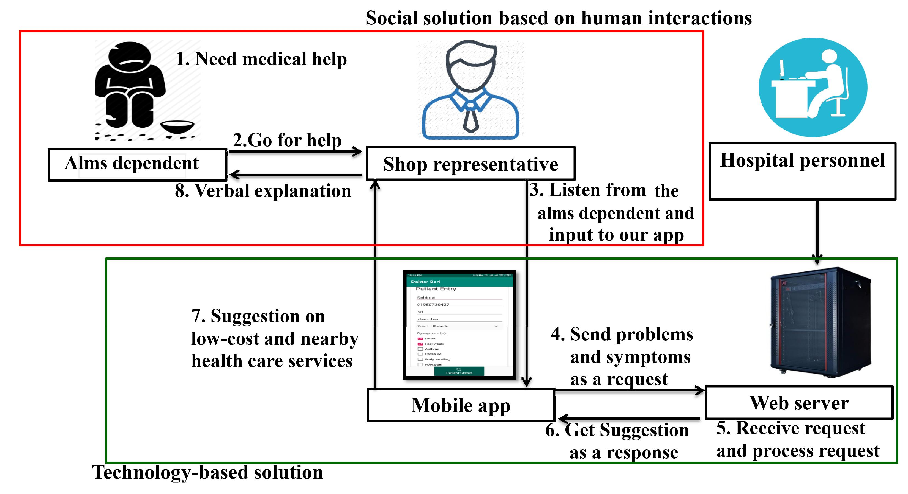
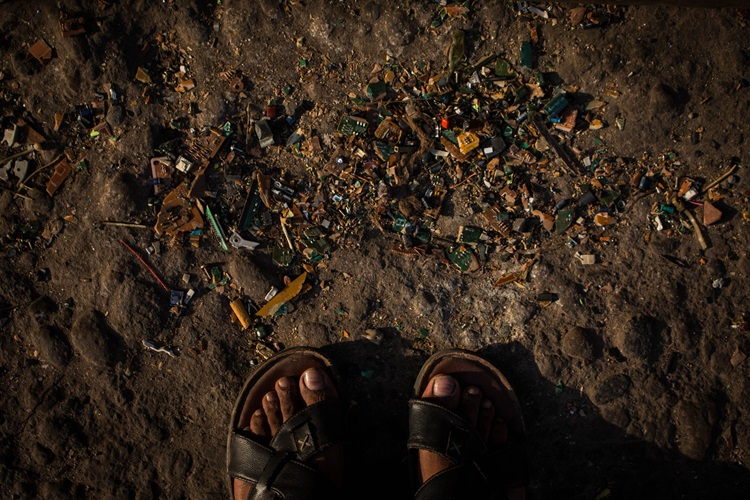

## I'm applying for research positions this year! Please let me know of suitable opportunities.

I'm a fourth year undergrad in [Computer Science][cs] at [Bangladesh University of Engineering & Technology][buet] advised by [A.B.M. Alim Al Islam][razi]. I am also a research associate to [Syed Ishtiaque Ahmed][ishtiaque] at [University of Toronto][toronto]. In my research I employ my designing, prototyping, and coding skills to **iteratively design and build** effective [technology for **communities at margins**][dakter_bari]. I also employ my training on mixed method to understand the (often unintended) ways end-users [contextually interact with technological interventions][uber] and [second-hand][second]/broken devices.
<ol>
<li> My broader interest encompassing civic technology & Internet, ICTD, social computing, and psychology</li>
<li> Five years experience working for an environmental organisation and  knowledge of Sustainability, and </li>
<li> My research training </li>
</ol>
intersect at the academic work I do. I love working with people. I have **surveyed** more than 2000 people; **interviewed** more than 120 people; and conducted **quantitative and qualitative analyses** of survey, interview, and technology usage data.

**PS:** My first name pronunciation is more like "**Roy-han**" 

[cs]: https://cse.buet.ac.bd/
[buet]: https://www.buet.ac.bd/
[toronto]: http://cs.toronto.edu/
[ishtiaque]: http://ishtiaque.net
[razi]: https://sites.google.com/site/abmalimalislam/publications
[second]: https://en.wikipedia.org/wiki/Second_hand_(disambiguation)

<!-- Papers -->
[uber]: content/papers/cscw20d-sub1291-i52.pdf
[dakter_bari]: content/papers/cscw20d-sub1862-i52.pdf
[repair_covid]: content/papers/cscw21a-sub7252-i26.pdf
[book]: content/papers/repair_ewaste_book.pdf

<!--In addition to academic publications, I've written for a general audience on topics like [political bias in search results in _The Guardian_][guardian], and [social media sites and democracy in _Wired_][wired]. 

[wired]: https://www.wired.co.uk/article/how-to-fix-facebook
[guardian]:https://www.theguardian.com/commentisfree/2018/sep/06/google-search-results-rigged-news-donald-trump

Before my PhD, I graduated with....  -->

---
## Publications
**[Dakter Bari: Introducing Technological Intermediary to
Ensure Healthcare Services for Alms Dependents][dakter_bari]**\
**Rayhan Rashed**, Aminul Hoque Sohel, and A.B.M. Alim-Al Islam \
**ACM CSCW 2021**

**[Exploring the Tensions between the Owners and the Drivers of Uber Cars in Urban Bangladesh][uber]**\
S.M. Taiabul Hoque, **Rayhan Rashed**, Mehrab Bin Morshed, Naeemul Hassan, and Syed Ishtiaque Ahmed \
**ACM CSCW 2021**

---
## Research Highlights 

I have several ongoing threads of research, focusing on local and contextual appropriation of technological systems and tracking down the after-use phase of technology in third world countries.

### Contextualized Technology, Internet & Underserved Communities
 Note: I am really proud of this work! 

People depending on alms are a group of vulnerable citizens deprived of necessary healthcare support, consequences of which can be minor to severe, and in some cases, fatal. Bangladesh--having more than 700 thousands of them--is no different. One noticeable difference of these almsdependents compared to similar communities in other parts of the world is that their technology penetration is near-to-zero. Thus, technology-based (such as app-based, mHealth, etc.) solutions for providing healthcare support, which maybe possible in advanced countries, are not possible in lower income countries like Bangladesh. However, there does exist multiple healthcare services in Bangladesh intended for these impoverished communities,which mostly remain underused by the intended population. This scenario presents a unique challenge, wherethere is a gap between healthcare services and their intended recipients. We ask **How can we ensure healthcare informations to this community?** `Paper:`**[CSCW 2021][dakter_bari]**

In this project, currently in submission, studying this community we identify appropriate technology based information intermediaries. We then design, iteratively develop, deploy, and user-test such a solution in the field. The usage of the system for more than six months registering nearly 500 service requests demonstrates its efficacy in bridging the gap we identified in our study.

&nbsp;

---
**[Exploring the Tensions between the Owners and the Drivers of Uber Cars in Urban Bangladesh][uber]**

Most scholarly discussions around ridesharing applications center on the experiences of the drivers and the
riders (passengers), and thus the role of the owners of the cars, if they are different from the drivers, remain
understudied. However, in many countries in the Global South, the car owners are often different from the
car drivers, and the tensions between them often shape the experience with these ridesharing apps in those
countries. In this paper, currently under review, we dig deeper into this issue based on our interview-based study in Dhaka, Bangladesh. We
identify the contract models that facilitate the partnership between prospective Uber drivers without a car
and car owners seeking to rent their cars for Uber, describe the tensions between these two parties, provide a
nuanced cultural portrayal of their negotiation mechanisms, and highlight the reasons for which the driver or the owner leaves Uber. Our analysis reveals **how the local adoption of technology based sharing economy amplifies existing inequalities and disrupts the prevailing social dynamics.** `Paper:`**[CSCW 2021][uber]**

&nbsp;

---
**[Understanding Internet Usage in Rural Bangladesh: Effect of Seasonal Migration and Overseas Employment][cmd]**\
_Manuscript in preparation in collaboration with [ICT Division, Government of Bangladesh][ictd]_

In this project, we have collected internet usage data in rural areas from a large countrywide survey. With data collected from more than 8000 participants, we are working on analyzing how overseas employment--one of the biggest earning sources in rural families in Bangladesh-- and migration are shaping up the internet usage pattern, expectation, and strategies to minimize the costs.  

[ictd]: https://ictd.gov.bd/
[cmd]: www.rayhanrashed.github.io

&nbsp;

---
### Electronic Waste, Repair & Sustainability

**[Pandemic, Repair, and Resilience: Coping with Technology Breakdown during COVID-19 in Bangladesh][repair_covid]**\
**Rayhan Rashed**, Mohammad Rashidujjaman Rifat, Priyank Chandra, S.M. Taiabul Haque, and Syed Ishtiaque Ahmed.\
_Under Review @_ **CSCW 2021**

COVID-19 disrupted the existing ecosystem of technology repair and recycle in Bangladesh as visiting repair workshops became difficult and most repairers and e-waste workers had to temporarily close their businesses. Consequently, users were left with very few choices for fixing or recycling their devices. Based on our interviews with 30 repair and e-waste workers and 21 users of electronic devices we capture various aspects of this disruption and the corresponding coping mechanisms. 

This paper reports **how the repair and e-waste worker communities adopted various changes to their work**, provided remote services, and yet faced a decline in their business. On the other hand, **end-users learned to fix their devices**, collaborated with each other, and **negotiated with partially broken devices** to address this challenge.
 
 
&nbsp;

---
**[When and Why End-Users Chooses between Discarding  and Attempting Self Repair?][book]**\
_Manuscript in preparation in collaboration with Shion Guha and Syed Ishtiaque Ahmed_

---

Forked from: https://metaxa.net
